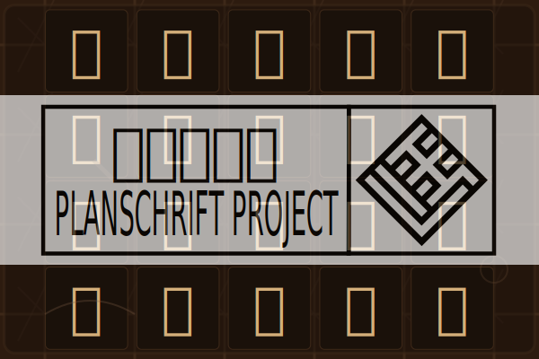

# 遍玨体项目（Planschrift Project）

## Overview

The **Planschrift Project** is a sub-project of the **Planiverse Font Family**, based on **Hwe Mincho**, aiming to supplement CJK Unified Ideographs Extension Areas using traditional (old-style) glyph forms as the standard.

## Coverage

This font aims to support all characters from **Extension B through Extension J** of the CJK Unified Ideographs. However, **Extension J is currently missing**, and other areas are only partially covered.

> [!WARNING]
>
> This font has **not yet been fully developed**. Missing characters were auto-generated using the **zi2zi** model, but have not been manually refined.

## License

This font follows the same license as the original font and is released under the [SIL Open Font License](https://openfontlicense.org/open-font-license-official-text/). See the [LICENSE file](LICENSE) for full details.

Unofficial Chinese translation of the license: https://www.maoken.com/ofl

License summary:

> **■ Hwe Mincho Font License Statement**
>
> - This font can be used freely for print, display, and embedding in digital documents and devices.
> - It can be redistributed freely.
> - It may be included in larger software packages for sale (but cannot be sold as a standalone product).
> - It can be modified to create new fonts.

### You may:

- Use the font **commercially or non-commercially**, for free, with no need to notify the author or cite sources.
- Re-distribute, install, or embed the font into any software or device.
- Modify, expand, or convert the font format. However:
  - **Do not use the reserved names “Planschrift” or “遍玨”** for modified versions.
  - Modified versions must still be released under the **same license**.
  - Format conversion **without any other modification** may continue using the reserved names.

### You may not:

- Sell or resell the font, either standalone or bundled with other fonts.
- Publish any part of the font under a different license.
- Use the font (or derivatives) to harm computer systems—e.g. by embedding malware or exploiting system vulnerabilities.
- Use the font for illegal purposes.
- Violate any of the license terms stated above.

### Notes:

- Anyone who uses, copies, modifies, or distributes this font agrees to the above license terms by doing so.
- This font is **free to use**. Any claims requiring payment are scams.
- If you paid for this font, **report it immediately** to relevant platforms or authorities.
- The author’s failure to enforce these terms shall not be considered a waiver of rights.
- This font contains **no political content or intent**, and the author assumes no legal responsibility for how it is used.

## FAQ

### 1. Why are there two font files?

- Because a single font file can only store up to **65,535 glyphs**, which is less than the total number of ideographs.

### 2. Why doesn’t this font support **Complex Text Layout (CTL)** or **Ideographic Variation Selectors (IVS)**?

- This font is intended as a **tool font** (for display only, not typesetting), like [Unifont](https://unifoundry.com/unifont) or [Noto Unicode](https://github.com/MY1L/Unicode/tree/main/NotoUnicode).
- Complex typesetting or alternate glyphs for regional forms **are not within scope**. If you need such features, you’re encouraged to make a derivative font yourself.

## Contact

For questions or suggestions, feel free to:

- This si the english version

## Additional Notes

1. The author is **not a professional type designer**, so glyph consistency may vary. Some characters may feel visually off, and complex component assembly was not prioritized. The font is provided as-is with no guarantees.
2. This project references several open-source fonts/tools:
    - [Source Han Sans (by Adobe)](https://github.com/adobe-fonts/source-han-sans)
    - [Zi.tools (by Bai Yi)](https://github.com/yi-bai)
    - [Unicode Character Database](https://www.unicode.org/charts/)
    - [Unihan Database](https://www.unicode.org/Public/16.0.0/ucd/Unihan.zip)
    - [Plangothic Project](https://github.com/Fitzgerald-Porthmouth-Koenigsegg/Plangothic_Project)
    - [Shanggu Black](https://github.com/GuiWonder/Shanggu)
    - [NanoOldSong](https://github.com/Hansha2011/NanoOldSong)

## About the Planiverse Font Family

Created by Fitzgerald in **December 2023**, the Planiverse Family includes:

1. **Plangothic Project**: Based on Source Han Sans, uses Simplified Chinese forms.
   - Status: Project created with [homepage](https://github.com/Fitzgerald-Porthmouth-Koenigsegg/Planschrift_Project), incomplete.

2. **Planwritzen Project**: Based on Fitzgerald’s own handwriting; builds on Plangothic glyphs.
   - Status: Project created, no homepage yet.

3. **Planschrift Project**: Based on Hwe Mincho, expands to include glyphs from Plangothic and Source Han.
   - Status: Project and homepage created, incomplete.

4. **Planseal Project**: Based on small seal script from Shuowen Jiezi.
   - Status: Project not yet started, name tentative.

5. **Planicon Project**: Supplements Unicode with glyphs from Zi.tools' icon-like characters.
   - Status: Project started, no homepage yet, name tentative.

6. **Plantsing Project**: Based on the Kangxi Dictionary (Wuyingdian edition), aligns with Plangothic character range.
   - Status: Not yet started.

7. **Plangul Project**: Creates Hangul glyphs in Chinese character style, based on Source Han Sans.
   - Status: Not yet started, name tentative.

8. **Planfixibit Project**: Based on [Fixedsys Excelsior](https://github.com/kika/fixedsys), tracks Unicode updates.
   - Status: Not yet started, name tentative.

9. **Plantone Project**: Based on the Kaicheng Stone Classics.
   - Status: Not yet started, name tentative.

> [!WARNING]
>
> 1. Technically, **Planicon, Planfixibit, and Plangul** do not fully meet the Planiverse standards—but are included for convenience.
> 2. **Planicon** may face potential copyright issues.
